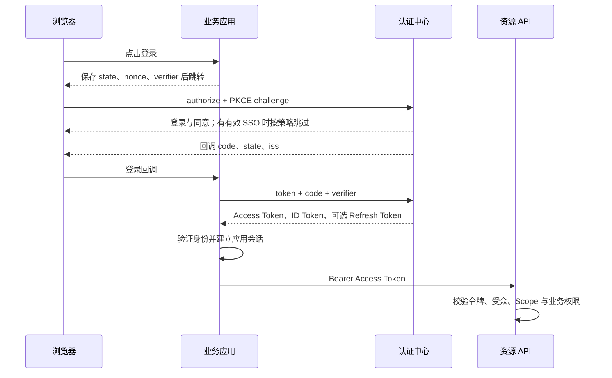

# 统一认证中心开发者使用手册

更新日期：2026-10-01。适用于当前 Vue3、Vue2 两个仓库的统一认证中心；两者使用相同的后端协议和接入配置。

本文面向平台管理员、业务应用开发者和资源服务开发者，按“启用服务 → 注册应用 → 登录 → 调用 API → 续期和退出”的顺序说明接入方法。本文的域名、客户端编号和凭据均为占位示例，使用时替换为实际值。

## 1. 选择接入方式

统一认证中心为外部应用提供 OpenID Connect（OIDC）登录和 OAuth 2.0 授权，支持以下方式：

| 场景                               | 客户端类型                   | 授权方式                                                   | 客户端认证                 |
| ---------------------------------- | ---------------------------- | ---------------------------------------------------------- | -------------------------- |
| 有后端的 Web 应用、BFF             | `confidential`（机密）       | `authorization_code` + PKCE S256；按需增加 `refresh_token` | `client_secret_basic`      |
| 纯浏览器 SPA、不能保管密钥的客户端 | `public`（公开）             | `authorization_code` + PKCE S256；按需增加 `refresh_token` | `none`，表单传 `client_id` |
| 定时任务、服务间调用               | `confidential`               | `client_credentials`                                       | `client_secret_basic`      |
| 资源 API 的在线令牌校验            | 独立的 `confidential` 客户端 | 调用 Introspection，并绑定到对应资源                       | `client_secret_basic`      |

当前不支持密码授权、Implicit、`client_secret_post`、PKCE `plain`，也不提供动态客户端注册。应用由平台管理员预先登记。原生应用若使用公开客户端，仍须满足当前 HTTP(S) 回调注册规则，不支持自定义 URI scheme。

原有管理后台/App 的登录 Token、菜单权限与 OIDC 相互隔离。OAuth Access Token 不能直接替代管理后台 Token 调用 `/system/**`；业务应用也不应把认证中心登录页当成管理后台登录接口。

### 1.1 各方负责什么

| 角色                             | 需要完成的工作                                                      |
| -------------------------------- | ------------------------------------------------------------------- |
| 平台管理员                       | 启用认证中心、初始化签名密钥、登记客户端/资源/Scope、管理授权和会话 |
| 业务应用（Client / RP）          | 发起授权、检查回调、兑换令牌、验证用户身份、维护自己的登录会话      |
| 资源服务（Resource Server / RS） | 验证 Access Token、受众和 Scope，并执行自己的业务数据权限判断       |

### 1.2 先理解三个标识

| 标识         | 示例                             | 用途                                         |
| ------------ | -------------------------------- | -------------------------------------------- |
| `client_id`  | 管理端生成的 `cli_...`           | 标识一个接入应用；客户端配置中的 `clientId`  |
| `resourceId` | `orders-api`                     | 管理端绑定资源的内部业务标识                 |
| `audience`   | `https://api.example.com/orders` | 令牌受众；协议请求的 `resource` 参数填写此值 |

管理 API 的 JSON 字段使用 `camelCase`，协议参数使用 `snake_case`。例如管理端的 `redirectUris` 是列表，授权请求中的 `redirect_uri` 是其中一个精确匹配的地址。

## 2. 准备地址和环境

后续示例统一使用：

| 配置            | 示例值                                    |
| --------------- | ----------------------------------------- |
| 认证中心 Issuer | `https://auth.example.com`                |
| 业务应用        | `https://app.example.com`                 |
| 登录回调        | `https://app.example.com/oidc/callback`   |
| 退出回调        | `https://app.example.com/oidc/logged-out` |
| 订单资源受众    | `https://api.example.com/orders`          |

Issuer 必须是无路径前缀、无查询串的固定公开地址。`OIDC_PUBLIC_BASE_URL` 必须与它一致；不能把 `/prod-api`、`/dev-api` 或 `/oauth2` 写进 Issuer。

生产环境使用 HTTPS。仅在应用环境为 `dev`、`test`、`local` 时允许 `localhost`、`127.0.0.1`、`::1` 的本机 HTTP；本地开发建议统一使用 `http://localhost`，不要在 Issuer、回调和浏览器地址之间混用 `localhost` 与 `127.0.0.1`。SSO Cookie 始终要求 `Secure`，不能通过关闭 Cookie 安全属性解决代理或浏览器问题。

## 3. 平台启用与检查

所有后端命令在 `ruoyi-fastapi-backend` 目录执行，并使用已安装项目依赖的 Python 3.10–3.13 环境。命令适用于 Windows PowerShell、macOS 和 Linux，不依赖特定的环境管理工具、环境名称或安装路径。创建与激活步骤见 [CLI 环境准备](cli_usage.md#22-安装依赖)。下面以 `dev` 环境为例，其他环境替换为对应的 `--env` 和配置文件。

`ruoyi` 命令在三个平台上的参数一致。激活环境后，直接调用解释器统一使用 `python`；在新终端执行命令前也应激活同一环境。

### 3.1 配置功能开关和密钥材料

在对应 `.env.<环境>` 中配置：

```dotenv
OIDC_ENABLED=true
OIDC_ISSUER=https://auth.example.com
OIDC_PUBLIC_BASE_URL=https://auth.example.com
OIDC_INTERACTION_LOGIN_URL=https://auth.example.com/auth-center/login
OIDC_INTERACTION_CONSENT_URL=https://auth.example.com/auth-center/consent
OIDC_INTERACTION_ERROR_URL=https://auth.example.com/auth-center/error

OIDC_REQUIRE_PKCE=true
OIDC_PKCE_METHODS=S256
OIDC_SIGNING_ALGORITHM=RS256
OIDC_TOKEN_HASH_PEPPER=<独立生成并长期保存的随机字符串>
OIDC_SIGNING_KEY_ENCRYPTION_KEY=<另一个独立生成并长期保存的随机字符串>

OIDC_SSO_COOKIE_NAME=__Host-ruoyi-sso
OIDC_SSO_COOKIE_SECURE=true
OIDC_SSO_COOKIE_SAMESITE=lax
OIDC_SSO_COOKIE_DOMAIN=
OIDC_LEGACY_AUTH_ISOLATION_ENABLED=true
```

三个交互页面地址必须与 Issuer 同源，即协议、主机和端口一致。修改密码页由认证中心流程进入，不需要另设一个交互 URL 配置。

Pepper 和签名密钥加密材料各至少 32 个 UTF-8 字节，彼此独立，也不要复用原有 JWT 或传输加密密钥。可执行两次以下命令生成两份不同的值，再通过部署配置或密钥管理系统保存：

Windows PowerShell：

```shell
python -c "import secrets; print(secrets.token_urlsafe(48))"
```

macOS / Linux（Bash、Zsh）：

```shell
python -c "import secrets; print(secrets.token_urlsafe(48))"
```

多实例使用同一套持久化配置。每次重启重新生成 Pepper 会使已有不透明凭据无法匹配；更换加密材料会影响数据库中现有签名私钥的解密。配置文件不提交真实密钥。修改环境配置后重启后端实例。

### 3.2 数据库、Redis 和首把签名密钥

先完成平台本身的数据库和 Redis 配置。新空库使用对应数据库的初始化 SQL；存量库按实际结构升级。完整初始化 SQL 含 `DROP TABLE`，不能向存量业务库直接重新导入。

当前启动流程可通过 `Base.metadata.create_all` 补建缺失表，但不会修改已有列或回填历史数据；当前没有认证模块专用的 Alembic 升级命令。

在数据库结构准备完成后启动后端，再初始化首把签名密钥：

```shell
ruoyi app run --env dev
```

在另一个终端执行：

```shell
ruoyi oidc key bootstrap --env dev --kid auth-primary --dry-run
ruoyi oidc key bootstrap --env dev --kid auth-primary --yes
ruoyi app doctor --env dev
```

若终端找不到 `ruoyi` 命令，可直接使用 Python 模块入口，将上面命令的 `ruoyi` 前缀替换为下表中的调用方式，其余参数保持不变：

| 系统 | 替代前缀 | 检查命令示例 |
| --- | --- | --- |
| Windows PowerShell | `python -X utf8 -m cli.main` | `python -X utf8 -m cli.main app doctor --env dev` |
| macOS / Linux（Bash、Zsh） | `python -X utf8 -m cli.main` | `python -X utf8 -m cli.main app doctor --env dev` |

生产密钥初始化还需要显式传入 `--allow-prod`，并指定实际生产环境。

`bootstrap` 会创建并激活首把 RSA 签名密钥，已有有效 Active 密钥时执行校验，可重复执行。`--dry-run` 不创建密钥。此流程将私钥加密存入数据库；使用这条路径不需要自行填写私钥文件路径或手工设置 `OIDC_ACTIVE_KID`。不要把客户端 Secret 当作签名私钥。

### 3.3 代理路由和前端开关

前端和协议端点需要通过正确的公开地址访问。部署代理至少保持以下关系：

| 浏览器请求路径                          | 目标                                        |
| --------------------------------------- | ------------------------------------------- |
| `/auth-center/**`                       | Vue 前端，深层路径刷新回落到 `index.html`   |
| `/.well-known/**`、`/oauth2/**`         | 后端，保留原始路径                          |
| `/auth/interaction/**`                  | 后端，保留原始路径、Cookie、Origin 等请求头 |
| `/prod-api/**` 或开发环境 `/dev-api/**` | 平台普通 API，移除该前缀后转发给后端        |

平台前端通过普通 API 前缀请求 `GET /auth/status`，例如浏览器中的 `/prod-api/auth/status`。该匿名接口只返回开关状态，数据部分为 `{"enabled": true}`，使用平台响应包装并禁止缓存。它不代表数据库、Redis 或签名密钥已经就绪。

当 `OIDC_ENABLED=false` 时，Vue3/Vue2 都会阻止进入认证中心登录、同意和修改密码页，展示“统一认证服务未启用”；状态请求失败时展示“暂不可用”。错误页仍可访问，普通后台登录不受影响。协议端点关闭时返回 404。前后端需同步发布，否则旧后端缺少状态接口会使新前端拒绝进入认证页。

### 3.4 确认服务可用

使用 Python 标准库检查公开端点，无需额外安装 HTTP 命令行工具。

Windows PowerShell：

```shell
python -c "import urllib.request; print(urllib.request.urlopen('https://auth.example.com/.well-known/openid-configuration', timeout=10).read().decode('utf-8'))"
python -c "import urllib.request; print(urllib.request.urlopen('https://auth.example.com/oauth2/jwks', timeout=10).read().decode('utf-8'))"
```

macOS / Linux（Bash、Zsh）：

```shell
python -c "import urllib.request; print(urllib.request.urlopen('https://auth.example.com/.well-known/openid-configuration', timeout=10).read().decode('utf-8'))"
python -c "import urllib.request; print(urllib.request.urlopen('https://auth.example.com/oauth2/jwks', timeout=10).read().decode('utf-8'))"
```

检查 Discovery 中的 `issuer` 和各端点是否为预期公开 HTTPS 地址，JWKS 是否包含可用 RSA 公钥，并确认 `ruoyi app doctor` 的 OIDC 检查通过。开关为真但无有效签名密钥时，Discovery/JWKS 等就绪检查可能返回 503；先检查密钥状态和加密配置。

## 4. 注册资源、Scope 和客户端

使用具有 OAuth 管理权限的后台账号操作。以下 JSON 用于说明与管理页面对应的配置，也可由受信任的管理程序调用 API。管理 API 需要原有管理后台身份和权限，不能拿业务应用的 OAuth Token 调用。

下文的 `/system/**` 为后端原始路径；通过前端代理调用时加上部署中的普通 API 前缀。管理结果使用平台 `{code, msg, data}` 等响应结构；OAuth 协议响应不使用这个包装。

### 4.1 登记业务资源

只有登录需求时可以暂时跳过资源和业务 Scope，只申请身份范围。若应用要访问订单 API，先在资源管理中创建以下资源，或调用 `POST /system/oauth/resource`：

```json
{
  "resourceId": "orders-api",
  "resourceName": "订单服务",
  "audience": "https://api.example.com/orders",
  "tokenFormat": "jwt",
  "signingAlg": "RS256",
  "accessTokenTtlSeconds": 600,
  "allowedClaims": []
}
```

`audience` 是稳定的受众标识，不需要认证中心访问该 URL。以后协议参数 `resource` 使用这个值。需要在线内省时，按第 7 节登记校验客户端，并在资源中设置它的 `introspectionClientId`。

### 4.2 登记业务 Scope

在权限范围管理中创建，或调用 `POST /system/oauth/scope`：

```json
{
  "scopeCode": "orders.read",
  "scopeName": "查看订单",
  "scopeType": "resource",
  "resourceId": "orders-api",
  "claims": [],
  "consentRequired": true,
  "sensitive": false,
  "status": "0"
}
```

资源 Scope 必须绑定资源；身份 Scope 不绑定资源。标识应使用稳定的英文编码，例如 `orders.read`、`orders.write`；显示名称可用中文。`status="0"` 为启用，`"1"` 为停用。

系统已有以下身份 Scope，无需重复创建：

| Scope            | 用途                                          |
| ---------------- | --------------------------------------------- |
| `openid`         | OIDC 用户登录，当前所有用户授权请求均要求携带 |
| `profile`        | 基础资料，例如显示名、用户名、头像            |
| `email`、`phone` | 邮箱、手机及相应验证状态                      |
| `dept`           | 部门信息                                      |
| `roles`          | 经客户端允许列表过滤后的角色信息              |
| `offline_access` | 申请刷新令牌资格                              |

最终返回字段还受用户实际资料、获准 Scope 和 Claim 策略控制。允许申请 `roles` 不等于可读取全部后台角色；客户端的 `allowedRoleKeys` 为空时不发布角色。业务服务仍需自行判断数据归属和操作权限。

### 4.3 登记有后端的业务应用

在客户端管理页面（默认 `/oauth/client`）新增应用，或调用 `POST /system/oauth/client`：

```json
{
  "clientName": "订单工作台",
  "clientType": "confidential",
  "tokenEndpointAuthMethod": "client_secret_basic",
  "grantTypes": ["authorization_code", "refresh_token"],
  "responseTypes": ["code"],
  "requirePkce": true,
  "requireConsent": true,
  "trustedClient": false,
  "scopeCodes": ["openid", "profile", "offline_access", "orders.read"],
  "resourceIds": ["orders-api"],
  "allowedRoleKeys": [],
  "preAuthorizedScopeCodes": [],
  "redirectUris": ["https://app.example.com/oidc/callback"],
  "postLogoutRedirectUris": ["https://app.example.com/oidc/logged-out"],
  "backchannelLogoutUris": [],
  "corsOrigins": []
}
```

保存响应中的 `data.clientId`。`client_id` 由平台生成，不使用应用名称或资源编号替代。

创建客户端不会自动返回 Secret。机密客户端保存后，还要在行操作中“生成/轮换密钥”，或调用 `POST /system/oauth/client/{client_id}/secret`，请求体可为 `{}`。响应中 `data.clientSecret` 只显示这一次，应立即保存到应用后端的安全配置；后续详情接口无法找回明文。公开客户端不生成 Secret。

URI 和授权策略需要满足以下规则：

- 登录回调与退出回调分别注册、精确匹配；不能使用通配符、URL 用户信息或 fragment。路径、端口、查询串和尾部斜杠应与实际请求保持一致。
- 生产回调使用 HTTPS；本机开发可登记本机 HTTP。Back-Channel 地址还受更严格的公网 HTTPS 和网络地址校验，见第 10 节。
- 所有 `authorization_code` 客户端都必须开启 PKCE S256、配置 `responseTypes: ["code"]` 和至少一个登录回调。
- `refresh_token` 必须与 `authorization_code` 同时启用。用户还需实际获准 `offline_access`，才会收到 Refresh Token。
- `scopeCodes`、`resourceIds` 指向已存在且启用的配置；一个请求当前只能选择一个业务资源，相关业务 Scope 应属于该资源。
- 客户端类型创建后不能直接修改；由公开类型切换为机密类型时应另建客户端。常规接入保持显式同意，可信应用及预授权范围由管理员按实际业务配置。

### 4.4 纯前端 SPA 的差异

将客户端设为 `public`，认证方式设为 `none`，其余授权码与 PKCE 配置保留；`corsOrigins` 登记应用 Origin，例如 `https://app.example.com`，不带路径或尾部斜杠。也可由管理员配置 `OIDC_CORS_ALLOWED_ORIGINS` 的逗号分隔 Origin 列表。

浏览器直接调用 Token/UserInfo 端点时才需要相应跨域配置。有后端代为兑换令牌的应用通常无需这项配置。发起授权和退出使用浏览器页面跳转，不通过跨域 AJAX 获取登录页面。SPA 不保管客户端 Secret，不能使用 `client_credentials`。

## 5. 接入用户登录

外部应用从 `/oauth2/authorize` 发起流程，由认证中心创建交互并导航到登录、同意或修改密码页。不要直接拼接 `/auth-center/login`，也不要调用 `/auth/interaction/**` 模拟外部应用登录。



### 5.1 生成授权请求

建议用支持 OIDC Authorization Code + PKCE 的库实现完整流程。下面展示 Python 服务端的核心参数生成，方便与现有框架集成；后续示例可放在同一模块中，依赖 `httpx` 和 `PyJWT[crypto]`。

```python
import base64
import hashlib
import secrets
import time
from urllib.parse import urlencode

ISSUER = 'https://auth.example.com'
CLIENT_ID = 'cli_REPLACE_WITH_REGISTERED_ID'
REDIRECT_URI = 'https://app.example.com/oidc/callback'
RESOURCE = 'https://api.example.com/orders'


def begin_login():
    verifier = secrets.token_urlsafe(48)
    challenge = base64.urlsafe_b64encode(hashlib.sha256(verifier.encode('ascii')).digest()).rstrip(b'=').decode('ascii')
    transaction = {
        'state': secrets.token_urlsafe(32),
        'nonce': secrets.token_urlsafe(32),
        'verifier': verifier,
        'expires_at': time.time() + 300,
    }
    parameters = {
        'client_id': CLIENT_ID,
        'response_type': 'code',
        'response_mode': 'query',
        'redirect_uri': REDIRECT_URI,
        'scope': 'openid profile offline_access orders.read',
        'resource': RESOURCE,
        'state': transaction['state'],
        'nonce': transaction['nonce'],
        'code_challenge': challenge,
        'code_challenge_method': 'S256',
    }
    return f'{ISSUER}/oauth2/authorize?{urlencode(parameters)}', transaction
```

把 `transaction` 保存在与当前浏览器会话绑定的短期服务端存储中，并按 `state` 区分并发登录。回调处理时原子取出并删除，防止重复使用；不要把 verifier 或 Secret 放到授权 URL、前端日志或可被其他浏览器重放的共享状态中。公开 SPA 可由 OIDC 库在浏览器中维护对应短期状态。

仅登录时从 `scope` 移除 `orders.read`，并完全省略 `resource`；不需要续期时移除 `offline_access`。当前用户授权请求即使只关心业务 API，也必须包含 `openid` 和 `nonce`。一次请求不能携带多个业务资源。

可选参数：`prompt=login` 强制重新登录，`prompt=consent` 要求重新同意，`prompt=none` 尝试无交互授权，`max_age` 要求认证新鲜度。`none` 不能与其他 prompt 值一起使用；静默授权返回 `login_required`/`consent_required` 时应重新发起允许交互的流程。

授权端点也接受 `application/x-www-form-urlencoded` 的 POST，此时所有授权参数放在表单体，不能同时在查询串传参，不能重复传同名参数。

### 5.2 接收回调并兑换授权码

成功回调形如：

```text
https://app.example.com/oidc/callback?code=...&state=...&iss=https%3A%2F%2Fauth.example.com
```

回调路由应拒绝重复的 `state`、`iss`、`code`、`error` 参数，校验与本次浏览器事务绑定的 `state`、过期时间和固定 Issuer，再处理成功或错误结果。错误回调不能建立登录会话。

以下函数接收框架已提取、无重复参数的字典，以及从当前浏览器会话中一次性取出的事务。`client_secret` 由服务端安全配置提供；公开客户端传 `None`。

```python
import httpx


async def exchange_code(query, transaction, client_secret=None):
    if not transaction or time.time() >= transaction['expires_at']:
        raise ValueError('登录事务不存在或已过期，请重新登录')
    if not secrets.compare_digest(query.get('state', ''), transaction['state']):
        raise ValueError('state 不匹配')
    if query.get('iss') != ISSUER:
        raise ValueError('授权响应 issuer 不匹配')
    if query.get('error'):
        raise ValueError(f'授权未完成：{query["error"]}')
    if not query.get('code'):
        raise ValueError('回调缺少授权码')

    form = {
        'grant_type': 'authorization_code',
        'code': query['code'],
        'redirect_uri': REDIRECT_URI,
        'code_verifier': transaction['verifier'],
    }
    auth = None
    if client_secret is None:
        form['client_id'] = CLIENT_ID
    else:
        auth = httpx.BasicAuth(CLIENT_ID, client_secret)
    async with httpx.AsyncClient(timeout=10, follow_redirects=False) as client:
        response = await client.post(f'{ISSUER}/oauth2/token', data=form, auth=auth)
        response.raise_for_status()
        return response.json()
```

这里的 Basic 示例适用于平台生成的 URL 安全字符客户端编号和 Secret。自行实现客户端认证时，按 OAuth Basic 规则对客户端编号和 Secret 分别做表单编码后再组装 Basic Header；不要把 `client_secret` 放到 URL 或请求体。客户端认证和令牌传输都依赖 HTTPS。

授权码默认 90 秒有效、只能使用一次。兑换时 `redirect_uri` 必须与授权时一致，verifier 必须对应本次 challenge。该次兑换不要附加 `scope` 或 `resource`，授权内容已绑定在授权码上。兑换失败或超时后不要反复重放同一个授权码，应重新开始登录。

协议返回的是原始 OAuth JSON，例如：

```json
{
  "access_token": "<access-token>",
  "token_type": "Bearer",
  "expires_in": 600,
  "scope": "openid profile offline_access orders.read",
  "id_token": "<id-token>",
  "refresh_token": "<refresh-token>"
}
```

以实际返回的 `scope`、`expires_in` 和可选字段为准；用户可能只同意部分范围。收到这些字符串并不等于已经验证用户身份。

### 5.3 验证 ID Token，再创建应用登录会话

ID Token 用于登录身份，Access Token 用于资源访问，Refresh Token 用于续期。三者不要混用。JWKS 地址从固定可信 Issuer 的 Discovery 获取，核对 Discovery 的 `issuer`；不得按未验证 Token 的 `iss`、`jku` 等字段动态选择信任来源。

下面是适配当前 RS256 Profile 的最小校验示例。固定 JWKS 来源，校验类型、算法、签名、受众、时效、nonce 和 `at_hash`；如请求使用了 `max_age`，还需由 OIDC 库按 `auth_time` 校验相应要求。

```python
import jwt

jwks_client = jwt.PyJWKClient(f'{ISSUER}/oauth2/jwks', timeout=5)


def verify_identity(tokens, expected_nonce):
    id_token = tokens['id_token']
    header = jwt.get_unverified_header(id_token)
    if header.get('alg') != 'RS256' or header.get('typ') != 'JWT':
        raise ValueError('ID Token 类型或算法不正确')
    if not isinstance(header.get('kid'), str) or not header['kid'].strip():
        raise ValueError('ID Token 缺少 kid')
    if any(name in header for name in ('crit', 'jku', 'jwk', 'x5u', 'x5c')):
        raise ValueError('不支持的 JWT Header')
    key = jwks_client.get_signing_key_from_jwt(id_token).key
    claims = jwt.decode(
        id_token,
        key,
        algorithms=['RS256'],
        issuer=ISSUER,
        audience=CLIENT_ID,
        leeway=60,
        options={'require': ['iss', 'sub', 'aud', 'exp', 'iat', 'nonce', 'sid']},
    )
    if not isinstance(claims.get('sub'), str) or not claims['sub']:
        raise ValueError('ID Token 缺少有效 sub')
    nonce = claims.get('nonce')
    if not isinstance(nonce, str) or not secrets.compare_digest(nonce, expected_nonce):
        raise ValueError('nonce 不匹配')
    audiences = claims['aud'] if isinstance(claims['aud'], list) else [claims['aud']]
    if len(audiences) > 1 or 'azp' in claims:
        if claims.get('azp') != CLIENT_ID:
            raise ValueError('azp 不匹配')
    if 'at_hash' in claims:
        digest = hashlib.sha256(tokens['access_token'].encode('ascii')).digest()
        expected_hash = base64.urlsafe_b64encode(digest[:16]).rstrip(b'=').decode('ascii')
        if not isinstance(claims['at_hash'], str) or not secrets.compare_digest(claims['at_hash'], expected_hash):
            raise ValueError('at_hash 不匹配')
    return claims
```

`get_signing_key_from_jwt` 可能访问 JWKS 网络端点，在异步 Web 路由中将同步验证放在线程池，或使用支持异步获取与缓存 JWKS 的 OIDC 库。遇到未知 `kid` 时刷新可信 JWKS 并重新校验，失败则拒绝；不能临时关闭签名验证。

完成 `verify_identity(tokens, transaction["nonce"])` 后，以 `(iss, sub)` 作为外部用户稳定标识，按业务需要关联本地用户，并保存 `sid` 以处理退出通知。用户名、手机号、邮箱都不应当作不变的外部主键。

有后端的应用把令牌保存在服务端，只给浏览器自己的随机会话 Cookie，并设置 `HttpOnly`、`Secure` 和适合业务的 `SameSite`。应用自己的写操作仍需要相应 CSRF 防护。认证中心不会替应用创建本地登录态，也不会自动配置应用的数据权限。

### 5.4 获取用户资料

用用户 Access Token 请求 `GET /oauth2/userinfo`，或带相同 Bearer Header 的 POST：

```http
GET /oauth2/userinfo HTTP/1.1
Host: auth.example.com
Authorization: Bearer <access-token>
```

返回原始用户 Claims JSON；核对返回的 `sub` 与已验证 ID Token 相同。字段取决于获准身份 Scope 及 Claim 策略。机器令牌不用于 UserInfo。

## 6. 应用调用业务 API

将 Access Token 放在 Header，不放到 URL：

```http
GET /orders HTTP/1.1
Host: api.example.com
Authorization: Bearer <access-token>
```

订单服务必须验证令牌针对 `https://api.example.com/orders` 签发，并检查包含 `orders.read`。拿到 `openid profile` 不代表具有订单读取权限；用户允许登录也不等于应用可以访问所有资源。

用户 Access Token 的受众包括认证中心 UserInfo，申请业务资源时另含相应业务受众；机器 Access Token 仅面向选定业务资源。不能因为 JWT 签名正确或包含某个 Scope 就省略 `aud` 校验。

## 7. 资源服务验证令牌

### 7.1 在线内省：用于及时响应撤销

新建一个专供订单 API 校验令牌的机密客户端，例如：

```json
{
  "clientName": "订单服务令牌校验",
  "clientType": "confidential",
  "tokenEndpointAuthMethod": "client_secret_basic",
  "grantTypes": ["client_credentials"],
  "responseTypes": [],
  "requirePkce": true,
  "scopeCodes": [],
  "resourceIds": [],
  "redirectUris": []
}
```

生成并保存该客户端的 Secret，然后编辑订单资源，将 `introspectionClientId` 设置为这个新客户端的 `clientId`。这里的校验权限来自资源绑定，不是来自 `grantTypes` 或业务客户端的申请范围。

订单 API 使用该校验客户端的 Basic 凭据调用：

```http
POST /oauth2/introspect HTTP/1.1
Host: auth.example.com
Authorization: Basic <校验客户端编号与密钥按规则编码后的值>
Content-Type: application/x-www-form-urlencoded

token=<urlencoded-access-token>&token_type_hint=access_token
```

校验顺序：

1. 检查 HTTP 调用成功，且响应 `active` 严格为 `true`。
2. 检查 `iss`、`aud` 是否属于预期认证中心和订单资源，必要时限制 `client_id`。
3. 将空格分隔的 `scope` 拆分，检查本次操作要求的范围。
4. 根据 `gty` 区分用户访问和机器访问，再执行资源自己的用户/租户/记录级授权。

失效响应为 `{"active": false}`。未绑定到该资源的其他客户端，即使知道某个有效 Token，也不能据此内省成功。只面向 UserInfo、没有业务资源受众的 Token 不用于这条资源内省路径；获取用户资料应调用 UserInfo。

内省超时或 5xx 应作为认证依赖不可用处理，不能放行。缓存内省结果会引入撤销延迟；需要即时反映授权撤销或会话下线的接口，应控制或避免正向缓存。

### 7.2 本地 JWT 校验：接受失效传播延迟时使用

固定可信 Issuer/JWKS 和 `RS256`，校验 `typ=at+jwt`、签名、`kid`、`iss`、预期业务 `aud`、`exp`/`nbf`/`iat`、Scope，以及当前接口允许的用户/机器令牌类型。不要接受 `typ=JWT` 的 ID Token 或 `logout+jwt` 的退出通知令牌作为 API 凭据。

本地验签不能自动得知 Grant 撤销、会话下线或客户端停用；已有 JWT 在本地到期前可能仍通过纯密码学检查。需要及时失效时使用在线内省或可靠的状态同步。当前实现的完整 Token Profile 可参考 [JWT 校验代码](../module_identity/security/jwt_profile.py)。

## 8. 刷新令牌与会话续期

取得 Refresh Token 需要客户端允许 `refresh_token`，且用户本次实际获准 `offline_access`。“记住授权选择”和浏览器“保持登录”均不等于获得离线访问资格。

机密客户端使用 Basic，公开客户端不传 Basic、改在表单中加入 `client_id`：

```http
POST /oauth2/token HTTP/1.1
Host: auth.example.com
Authorization: Basic <业务应用的客户端认证值>
Content-Type: application/x-www-form-urlencoded

grant_type=refresh_token&refresh_token=<urlencoded-current-refresh-token>
```

每次成功续期都会轮换 Refresh Token。将新的 Access Token、Refresh Token 和到期信息原子替换到应用会话中；当前刷新响应不重新签发 ID Token，不要覆盖原有已验证身份记录为“空”。

同一个应用会话的刷新操作必须串行化，多个并发 API 请求不能各自使用同一 Refresh Token。复用已使用的 Refresh Token 会触发令牌家族失效；请求超时且无法确认是否已经轮换时，不要盲目重试旧凭据，应重新授权恢复。

刷新时可选 `scope` 仅能缩小原授权；不能扩大权限，不能切换业务资源。若发送 `resource`，必须与原资源一致。新增 Scope 或切换资源应重新走授权码流程。

默认时限如下；客户端、资源配置和全局上限可能进一步限制实际结果，应以响应为准：

| 配置                            | 默认值                         |
| ------------------------------- | ------------------------------ |
| 授权码                          | 90 秒                          |
| 登录/同意交互                   | 300 秒                         |
| ID Token                        | 300 秒                         |
| Access Token                    | 600 秒，全局最大值默认 1800 秒 |
| Refresh Token 闲置期限          | 7 天                           |
| Refresh Token 绝对期限          | 30 天，轮换不重置原始绝对期限  |
| SSO 闲置期限                    | 30 分钟                        |
| SSO 普通绝对期限 / 保持登录期限 | 8 小时 / 7 天                  |
| 时钟容差                        | 60 秒                          |

SSO 会话自然到期不自动取消已允许的离线授权；显式退出、管理员下线、授权撤销、用户被禁止访问或相关安全状态变化会阻断对应访问和续期。

## 9. 服务间调用

为后台任务单独登记机密客户端，只开启 `client_credentials`，绑定需要的资源和资源 Scope。例如：

```json
{
  "clientName": "订单同步任务",
  "clientType": "confidential",
  "tokenEndpointAuthMethod": "client_secret_basic",
  "grantTypes": ["client_credentials"],
  "responseTypes": [],
  "requirePkce": true,
  "scopeCodes": ["orders.read"],
  "resourceIds": ["orders-api"],
  "redirectUris": []
}
```

该流程没有授权回调，也没有 PKCE 参数交换；管理模型保留 `requirePkce=true` 不影响机器授权。保存后生成客户端 Secret，再发送：

```http
POST /oauth2/token HTTP/1.1
Host: auth.example.com
Authorization: Basic <机器客户端的认证值>
Content-Type: application/x-www-form-urlencoded

grant_type=client_credentials&scope=orders.read&resource=https%3A%2F%2Fapi.example.com%2Forders
```

`scope` 和 `resource` 都要明确填写，Scope 只能包含该资源的业务范围。不要申请 `openid`、`profile`、`offline_access`。响应只有 Access Token 等访问字段，没有 ID Token 或 Refresh Token，到期后重新获取。

机器令牌的 `gty=client_credentials`，`sub` 为 `client:<client_id>`。资源 API 不得将它当作某个用户身份，用户专属操作应拒绝机器令牌或使用单独的机器授权策略。

## 10. 退出、撤销与 Back-Channel

### 10.1 浏览器退出

应用发起退出时，为当前会话保存随机退出 `state`，将浏览器导航到 Discovery 中的 `end_session_endpoint`，参数示例：

```text
https://auth.example.com/oauth2/logout
  ?id_token_hint=<urlencoded-id-token>
  &post_logout_redirect_uri=https%3A%2F%2Fapp.example.com%2Foidc%2Flogged-out
  &state=<random-logout-state>
```

实际 URL 不换行，各参数均 URL 编码。`post_logout_redirect_uri` 必须已经在该客户端登记。保留本次需要的 `id_token_hint` 后，应用应按自己的退出语义清理本地会话；回到退出回调时验证预先保存的退出 state。

当前实现会展示退出确认页，用户确认后才清理认证中心会话及相关凭据。仅 GET 退出地址不立即执行全局退出。确认提交由认证中心页面完成，应用不要自行调用 `/oauth2/logout/confirm`。取消认证中心退出时，不能声称其他应用也已退出。

### 10.2 令牌撤销与管理员撤销的区别

客户端可以向 `/oauth2/revoke` 发送表单 `token` 和可选 `token_type_hint`，采用该客户端原有认证方式。未知或已撤销凭据按幂等语义成功处理。

| 操作                  | 当前影响                                                               |
| --------------------- | ---------------------------------------------------------------------- |
| 撤销 Refresh Token    | 终止相应刷新能力；不能视为立即撤销所有已经签发的 Access Token          |
| 撤销指定 Access Token | 阻断该 Token 的在线校验；纯本地验签仍需状态同步                        |
| 后台“外部授权 → 撤销” | 撤销该用户对该应用的现有 Grant 和关联刷新凭据；旧 Token 的在线校验失败 |
| 后台“访问策略 → 禁止” | 阻止该用户再向该应用授权，并撤销已有授权；可在首次登录前配置           |
| 解除访问禁止          | 允许重新授权，不恢复旧 Grant 或旧 Token                                |
| 后台“外部会话 → 下线” | 撤销对应 `sid` 的访问资格，包括自然过期会话遗留的离线资格              |
| 客户端停用            | 阻止新登录/签发，并撤销该客户端相关授权与凭据                          |

应用本地会话与资源 Token 分别管理：本地 Cookie 没有过期不代表资源授权仍然有效；收到资源拒绝或退出通知后，应更新应用的会话状态。

### 10.3 接收后端退出通知

需要跨应用及时退出时，登记客户端的 `backchannelLogoutUris`，例如 `https://app.example.com/oidc/backchannel-logout`。默认只允许通过安全校验的公网 HTTPS 地址，不允许查询串和私网/回环地址。

接收端支持表单 POST 参数 `logout_token`，并完成以下处理：

1. 固定可信 Issuer 和 JWKS，验证 RS256 签名、`typ=logout+jwt`、`kid`、`iss` 和 `aud=本客户端编号`。
2. 校验 `iat`、`exp`、`jti`，以及 `events` 中的 `http://schemas.openid.net/event/backchannel-logout: {}`。
3. 要求包含 `sid` 或 `sub`，且不能包含 `nonce`；按照被验证的 `sid`/`sub` 查找本应用会话。存在 `sid` 时优先精确匹配，避免误下线同一用户的其他设备。
4. 按 `(iss, client_id, jti)` 实现幂等处理，清理对应会话后返回 200；重复通知仍返回成功。临时处理失败返回 5xx，由投递端重试。

通知目标来自该 SSO 会话实际参与的客户端，不是所有使用过同一用户的应用。接收端不依赖用户浏览器 Cookie，也不要信任未验签的退出 Claims。

## 11. 密钥维护

客户端 Secret 和认证中心签名密钥是两套不同的凭据：

| 项目         | 客户端 Secret                                               | OIDC 签名密钥                                                 |
| ------------ | ----------------------------------------------------------- | ------------------------------------------------------------- |
| 用途         | 业务应用/资源服务向认证中心认证                             | 认证中心签发 JWT，接入方通过 JWKS 验签                        |
| 操作入口     | 客户端行操作“生成/轮换密钥”                                 | 签名密钥管理，默认 `/oauth/key`                               |
| 应用保存什么 | 机密客户端保存自己的 Secret                                 | 接入方只保存可信 Issuer 配置和缓存的公钥                      |
| 轮换重点     | 使用生效时间和旧 Secret 退役窗口，完成部署后再撤销旧 Secret | 先发布新公钥，再激活签名；保留旧公钥覆盖已有 Token 的验证窗口 |

普通客户端 Secret 轮换不会自动撤销正常用户授权。泄漏处置若需要阻断已有访问，应另外停用客户端或撤销相关授权，不能只依赖换 Secret。

签名密钥可通过 `POST /system/oauth/key/rotate` 创建 Pending 密钥，再通过 `PUT /system/oauth/key/{kid}/activate` 激活；安排发布、生效和旧密钥退役时间时考虑 Token 有效期、时钟容差及接入方 JWKS 缓存。不要删除仍用于验证未过期 Token 的旧公钥。

## 12. 接口速查

下表协议路径相对于固定 Issuer，不加平台 API 前缀：

| 方法       | 路径                                      | 用途与身份                                   |
| ---------- | ----------------------------------------- | -------------------------------------------- |
| GET        | `/.well-known/openid-configuration`       | OIDC Discovery                               |
| GET        | `/.well-known/oauth-authorization-server` | OAuth 服务端元数据                           |
| GET        | `/oauth2/jwks`                            | 公开验签密钥                                 |
| GET / POST | `/oauth2/authorize`                       | 浏览器用户授权；POST 使用表单                |
| POST       | `/oauth2/token`                           | 授权码兑换、刷新、机器授权；表单和客户端认证 |
| GET / POST | `/oauth2/userinfo`                        | 用户 Access Token 的 Bearer 认证             |
| POST       | `/oauth2/introspect`                      | 绑定资源的机密客户端 Basic 认证              |
| POST       | `/oauth2/revoke`                          | 令牌撤销；对应客户端认证                     |
| GET / POST | `/oauth2/logout`                          | 浏览器发起确认退出                           |

平台管理及内部页面接口：

| 路径                                                  | 用途                                                                         |
| ----------------------------------------------------- | ---------------------------------------------------------------------------- |
| `/auth/status`                                        | 匿名读取启用开关；平台响应包装，前端通过普通 API 前缀访问                    |
| `/auth/interaction/**`                                | 认证中心自己的登录、验证码、同意、修改密码和完成交互；不作为外部应用接入 API |
| `/system/oauth/client/**`                             | 客户端与 Secret 管理                                                         |
| `/system/oauth/resource/**`、`/system/oauth/scope/**` | 资源和权限范围管理                                                           |
| `/system/oauth/session/**`、`/system/oauth/grant/**`  | 会话、授权和访问策略管理                                                     |
| `/system/oauth/key/**`                                | 签名密钥管理                                                                 |
| `/monitor/oauth/audit/**`                             | OAuth 审计查询与导出                                                         |

管理端要求相应的 `system:oauthClient:*`、`system:oauthResource:*`、`system:oauthScope:*`、`system:oauthSession:*`、`system:oauthGrant:*`、`system:oauthKey:*` 等权限。菜单不可见时检查角色分配和对应菜单数据，不要改成匿名开放管理接口。

## 13. 常见问题

| 现象                                      | 优先检查与处理                                                                                                |
| ----------------------------------------- | ------------------------------------------------------------------------------------------------------------- |
| 认证页显示“未启用”                        | 当前后端实例的 `OIDC_ENABLED`、配置环境及是否重启；`/auth/status` 返回的开关值                                |
| 认证页显示“暂不可用”                      | 状态接口代理、后端是否同步升级、网络/超时；正常后台登录可用不代表 OIDC 已就绪                                 |
| 协议端点 404                              | 开关是否关闭，代理是否把协议误加 `/prod-api` 或转发到 SPA                                                     |
| Discovery/JWKS 503                        | Active 签名密钥、加密材料、数据库与 Redis 就绪状态；运行 `ruoyi app doctor`                                   |
| `invalid_client`                          | 客户端类型/认证方式、编号、Secret 生效与到期、是否已停用；机密客户端使用 Basic                                |
| 回调提示 `redirect_uri is not registered` | 精确比对已登记的协议、域名、端口、路径和查询串；不要依赖前缀匹配                                              |
| `invalid_request`                         | 缺少 nonce/PKCE、重复字段、JSON 代替表单、授权 POST 混用查询参数、错误响应模式                                |
| `invalid_scope` / `invalid_target`        | 是否包含 `openid`，范围是否启用并授权给客户端，资源是否允许，`resource` 是否填了 audience，是否混入第二个资源 |
| `invalid_grant`                           | 授权码过期/复用、verifier 或回调不一致、刷新凭据已使用/撤销、会话或授权状态变化；重新授权                     |
| 没收到 Refresh Token                      | 客户端是否启用刷新、请求是否含 `offline_access`、用户是否实际同意该范围                                       |
| 刷新后下次刷新失败                        | 是否原子保存新 Refresh Token，是否多个请求并发使用同一个旧值                                                  |
| 内省始终 `active=false`                   | RS 校验客户端是否绑定到对应资源、Token 是否含业务受众、授权/会话/客户端是否失效                               |
| UserInfo 401                              | 是否传用户 Access Token、是否过期/撤销；不要使用 ID Token、机器令牌或后台 Token                               |
| 角色/资料未返回                           | 获准 Scope、客户端角色允许列表、Claim 策略和用户实际资料；不要假设请求即获准                                  |
| SPA 跨域失败                              | 精确登记 Origin，检查预检代理；不要用 `*` 掩盖配置错误                                                        |
| 已登录却反复显示登录页                    | Issuer 与交互页是否同源，Cookie 是否因 HTTPS、主机、代理或浏览器策略未保存                                    |
| 登录/同意交互过期                         | 默认 5 分钟，重新从业务应用开始授权，不复用旧 `interaction` 链接                                              |
| `login_required` / `consent_required`     | 静默授权无法完成，重新发起允许页面交互的授权                                                                  |
| 429 / `temporarily_unavailable`           | 遵守 `Retry-After`，检查依赖与限流；不要循环重放一次性授权码或刷新凭据                                        |
| 退出后另一应用仍显示登录                  | 是否接收并验签 Back-Channel、是否映射并清理对应 sid、本地会话是否更新；仅清当前 Cookie 不会通知其他应用       |

排查时结合 OAuth 审计记录和服务端日志中的错误代码、客户端编号、会话/授权标识。日志中不记录 Secret、密码、授权码、完整 Token 或 verifier。

## 14. 接入验收清单

- 配置启用，Discovery/JWKS 可访问，关闭开关时三个认证交互页面被阻止，错误页与普通后台登录可用。
- 首次登录完成授权码 + PKCE；错误 state、nonce、Issuer、签名、受众或过期 Token 会被应用拒绝。
- 同一浏览器接入第二个应用可以复用 SSO，各应用仍分别遵守自己的授权策略。
- 仅身份登录、允许订单访问、拒绝订单范围三种场景的结果符合预期，API 不越权。
- Refresh Token 正确轮换并串行使用；用户不同意离线访问时不假定存在刷新凭据。
- 机器令牌可访问允许的资源，不能冒充用户或访问未授权资源。
- 撤销 Grant、禁止访问、会话下线和客户端停用能使在线内省/续期失败；解除禁止后需要重新授权。
- 全局退出经过用户确认；退出回调 state 正确；Back-Channel 验签、会话隔离、重复通知和失败重试有效。
- 客户端 Secret、签名密钥轮换后新凭据可用，过渡期旧凭据按预期验证，日志无敏感凭据。

在目标环境完成真实 HTTPS、反向代理、数据库并发、Cookie 与公网 Back-Channel 联调；单元测试不能替代这些部署验证。

## 15. 代码参考

需要了解具体实现时，可查阅以下配置、协议模型和令牌校验源码。

| 资料                                                                   | 用途                                    |
| ---------------------------------------------------------------------- | --------------------------------------- |
| [OIDC 配置](../config/env.py)                                          | 配置名、默认值和启动校验                |
| [协议数据模型](../module_identity/entity/vo/protocol_vo.py)            | 授权、Token 等入参约束                  |
| [客户端管理模型](../module_identity/entity/vo/oauth_client_vo.py)      | 客户端类型、Grant、URI 与 Secret 配置   |
| [资源与 Scope 模型](../module_identity/entity/vo/oauth_resource_vo.py) | 资源受众、内省绑定与 Scope 配置         |
| [JWT Profile](../module_identity/security/jwt_profile.py)              | Access/ID/Logout Token 的用途与完整校验 |
